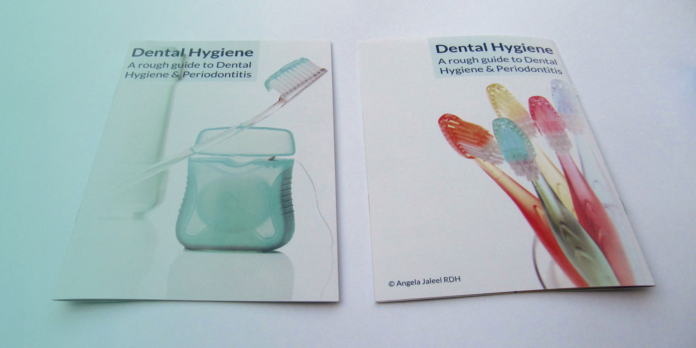
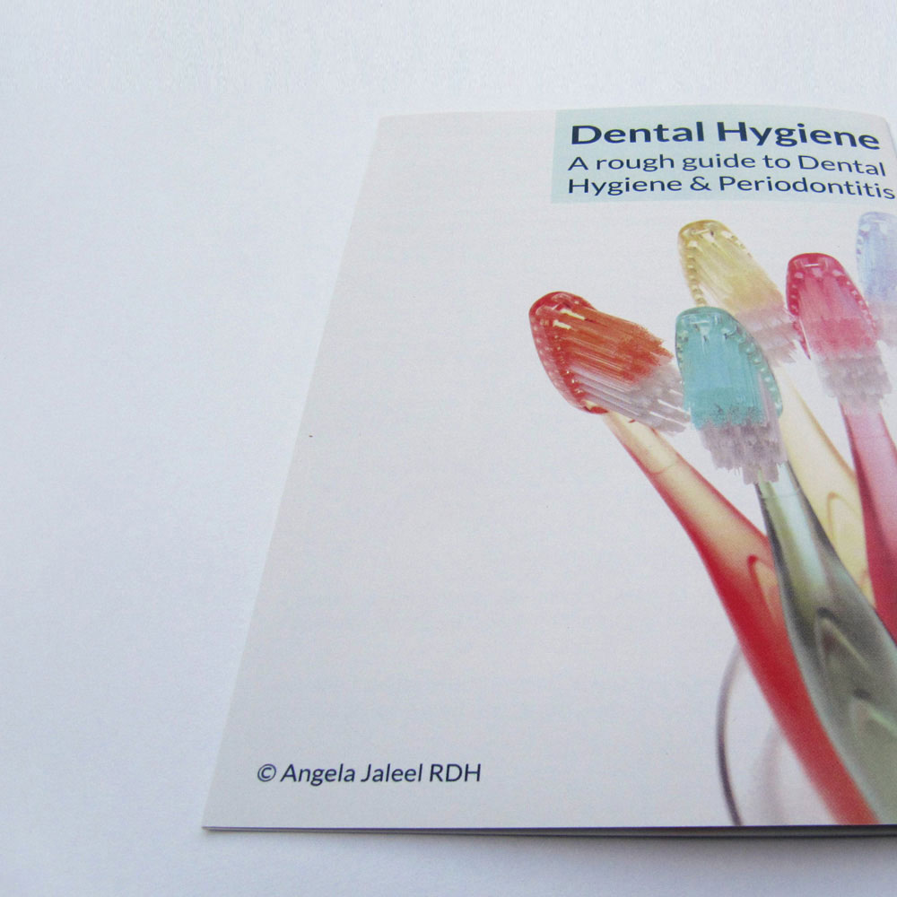
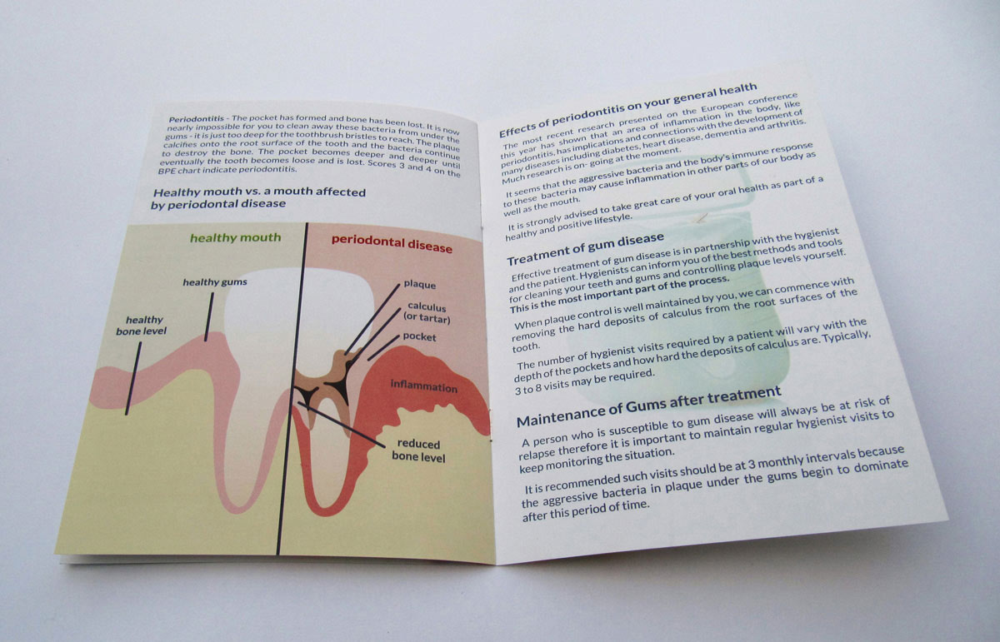
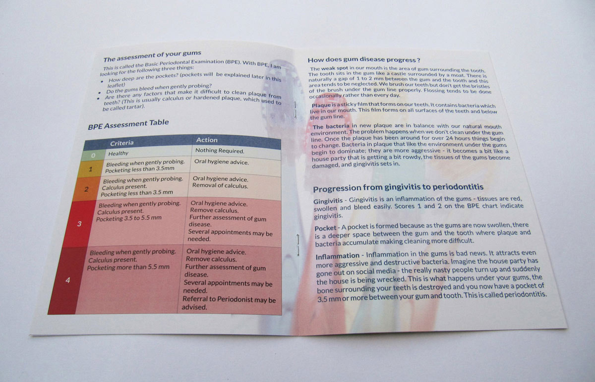

# Angela Jaleel
Dental Hygiene Brochure
An informative brochure, which aims to help people to improve their oral health

---

# Angela Jaleel
Information Brochure Design

---

Angela Jaleel is a Dental Hygienist who works with several dental practices in South Essex. A large proportion of her and her colleagues time is dedicated to treating Periodontal Disease, a progression from Gingivitis (gum disease). Successful treatment of Periodontal Disease requires significant patient behavioural changes.

Angela asked me to design an information brochure to give to patients, with the aim of helping them to understand their condition and improve their oral health. The Brochure explains the role of Dental Hygienists and what to expect at an appointment, also detailing the causes, symptoms (with a diagram to visualise), and treatment of Periodontal Disease.

The Brochure was complemented by patients and staff members alike.

_Diagram of a healthy tooth vs. a tooth affected by Periodontal Disease_

_Oral hygiene assessment chart_

---

other project
### For more complex information design, I recommend:
tfl