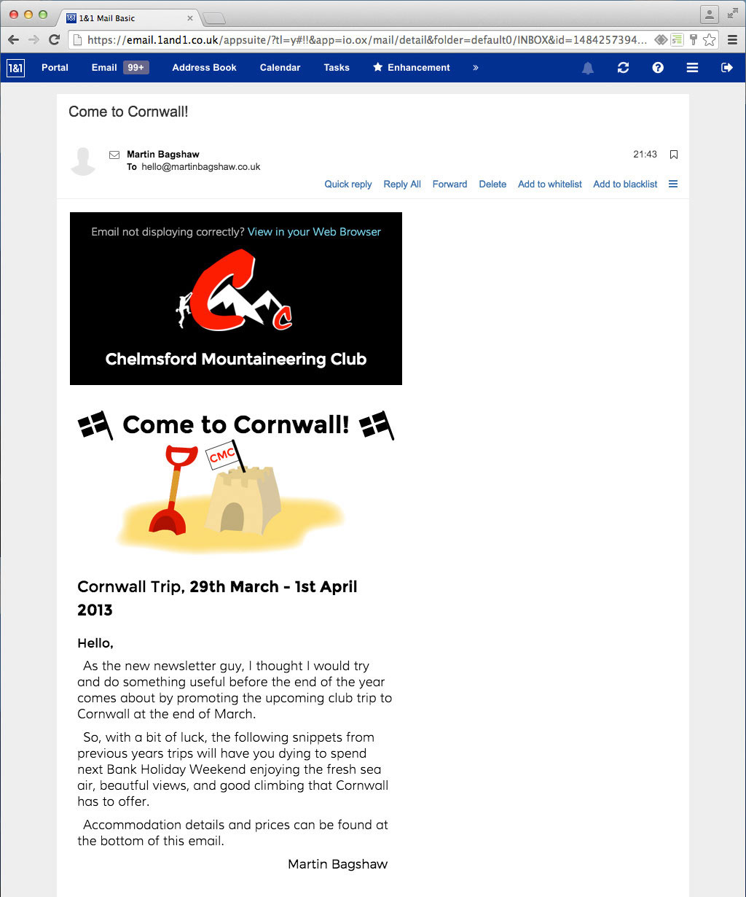

# Chelmsford Mountaineering Club
Print and Digital Design
Refreshing the design of print and digital communications for my local climbing club

---

# Chelmsford Mountaineering Club
Refreshing Print and Digital Design

---

I have helped my local rock climbing club out in the past with print and digital based design, refreshing the appearance of their communications.

In print format, I designed a new membership form and membership card template, a promotional flyer, and calendars for three consecutive years. In digital format, I put together annual newsletters, illustrating members stories (including some of my own), and sent out HTML emails to advertise trips to club members.

Aiming to standardise and simplify the design across different media, I picked a more legible main font, and separated information in a clearer way using colour, font weight, and spacing.

---

_Calendars for 2014, 2015, and 2016_

---

left column

---

right column

---

left column

---

right column

---

left column

---

right column

---

center column
## HTML Emails
Emails sent to club members to promote trips

---

left column

_Cornwall trip email_

---

right column

_A tongue-in-cheek Yorkshire trip email_

---

center column
## Newsletters
Spreads from 2013 and 2014 Newsletters. The downloads available below are best carried out over Wifi.

[Download 2013 Newsletter](2013-Newsletter.pdf) (10.2MB)

Download 2014 Newsletter

[Part One](2014-Newsletter_Part-One.pdf) (7.1MB) | [Part Two](2014-Newsletter_Part-Two.pdf) (6.5MB)

---

left column

_A dramatised account of rock climbing on sea cliffs (2013)_

---

right column

_Annual awards (2013)_

---

left column

_A story of a cycle tour through The Pyrenees (2013)_

---

right column

_Calendar photo competition winners (2014)_

---

left column

_Write up of a trip to Morocco (2014)_

---

right column

_A trip to the Barra Isles, Outer Hebrides (2014)_

---

other project
### Enjoyed this, but want to see design that is a little less conventional?
tom-hudson
