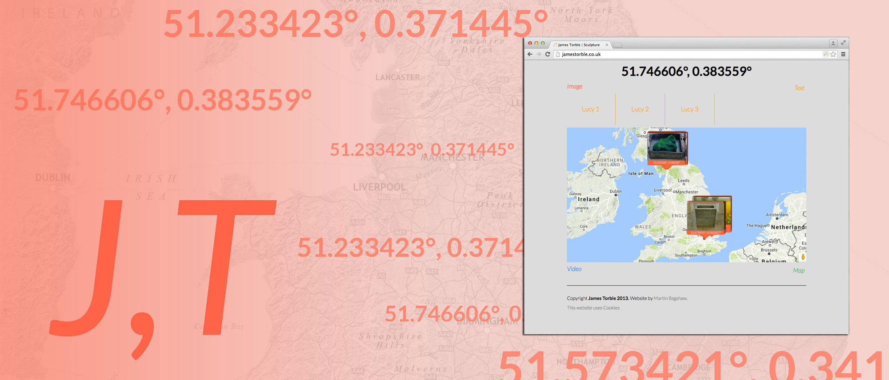
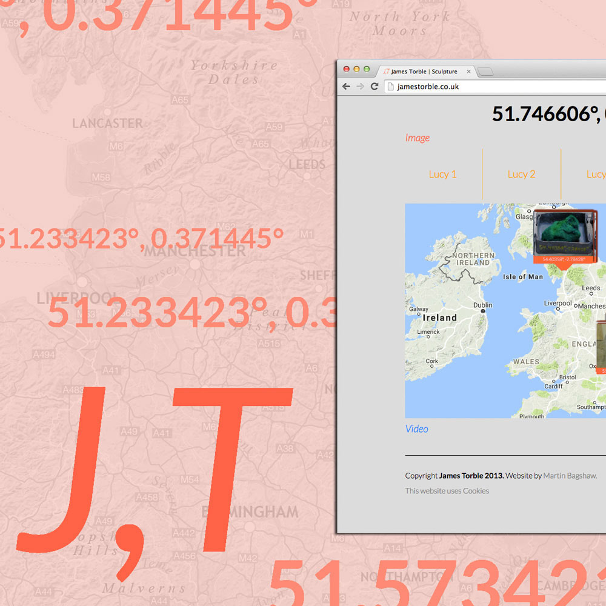
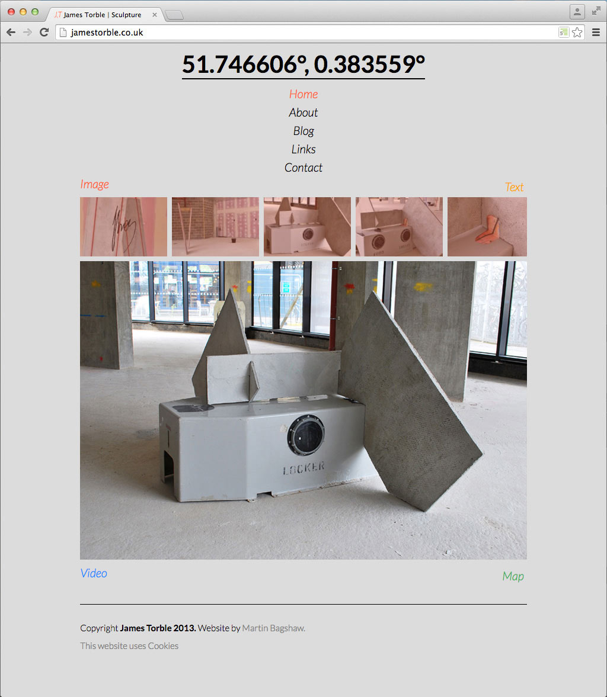
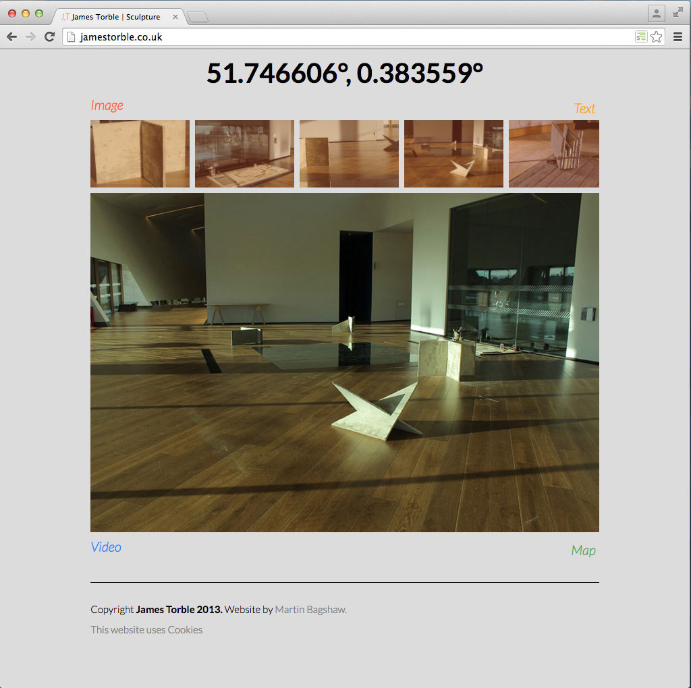
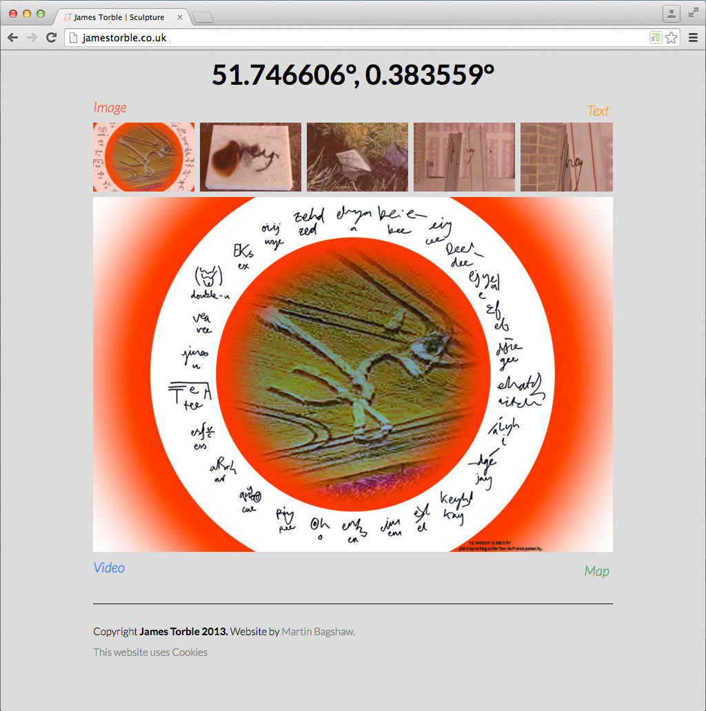
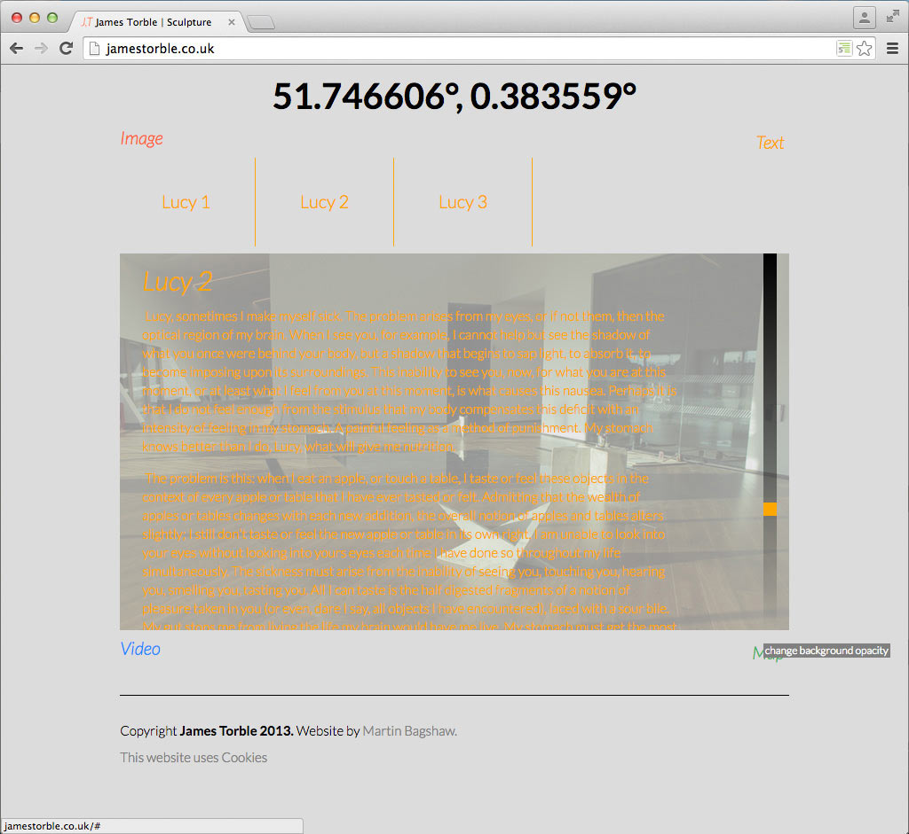
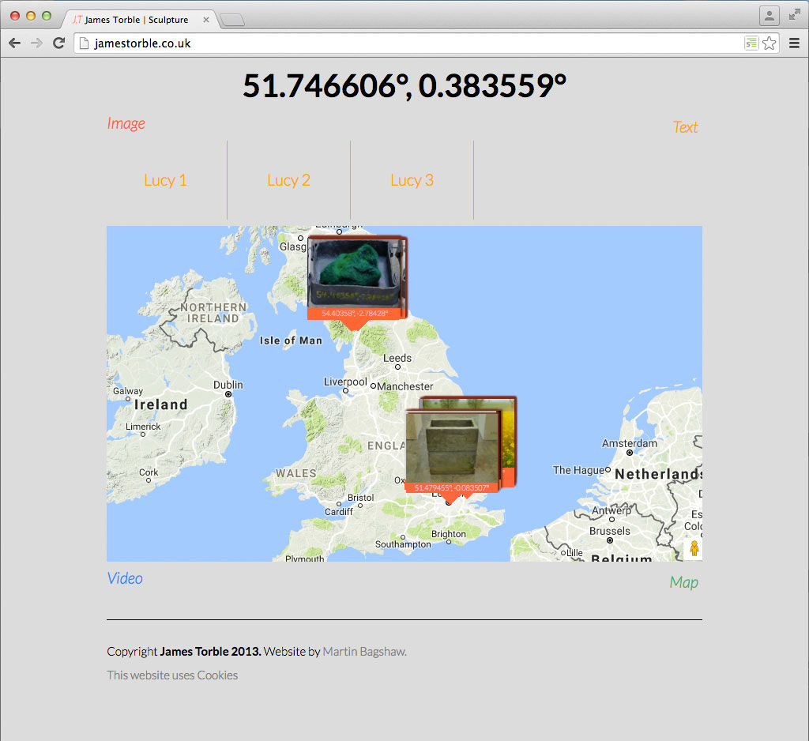

### # James Torble
Artist Website
An Ajax powered website, using Vimeo, Google Maps, and Geolocation API

---

# James Torble
Artist Website - Web Development with Ajax

---

James Torble is an Essex based sculpture artist.

Around the time I first met James, much of his work conveyed his feelings of unease with how our personal information is shared online; something that, in spite of safeguards, is often beyond our control.

James had a basic plan of how he wanted his personal website to look - a main container on the Home Page that would dynamically load images, texts, videos, and a Google Map with locations of his artwork without a page refresh, something he assumed would only be possible with the use of flash.

As James also wanted blog functionality, I built the site with WordPress, implementing the main content container functionality with Ajax. Data is called from the website database and Vimeo, where James uploads his videos. In addition, I used the HTML5 geolocation API to code a feature that takes James's location from his mobile phone, and prints out the coordinates as the site title.

_Main Menu dropdown_

---

left column

---

right column

---

left column

_Background image can be faded with a slider_

---

right column

_Google Map shows thumbnail images of art works and their location_

---

other project
### Time for something completely different...
lunalux