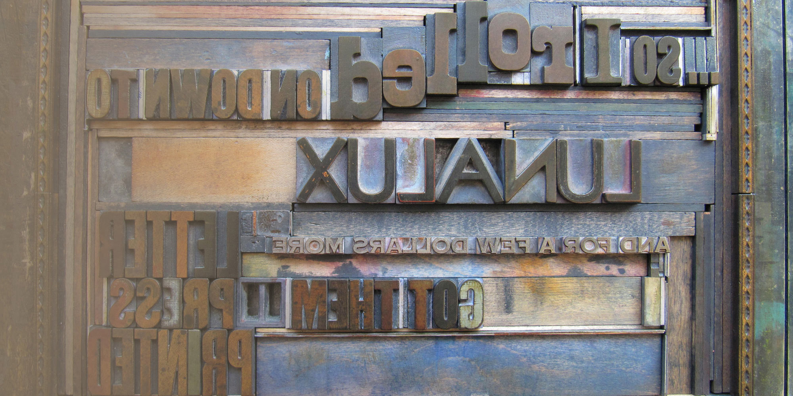
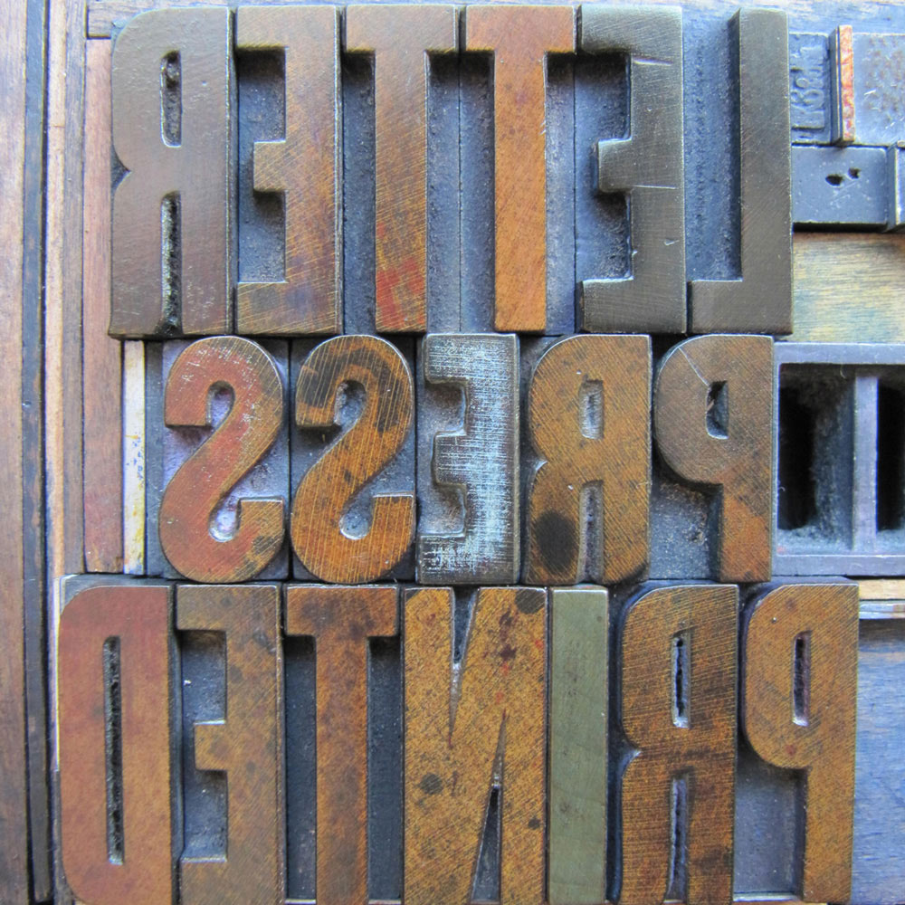
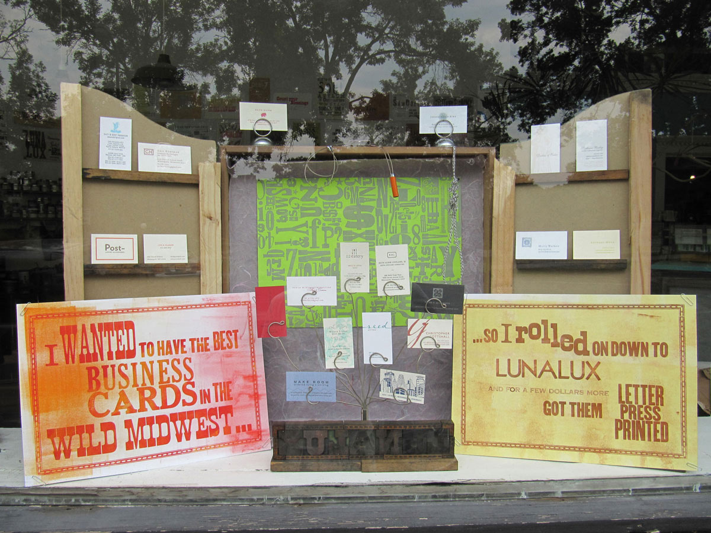
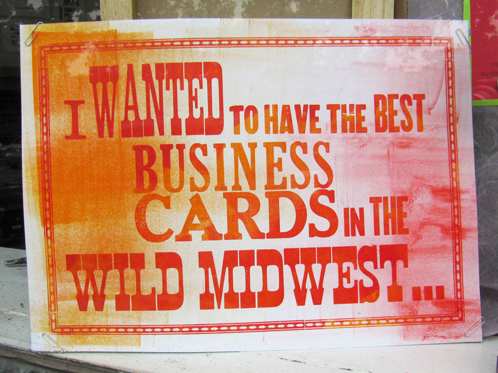
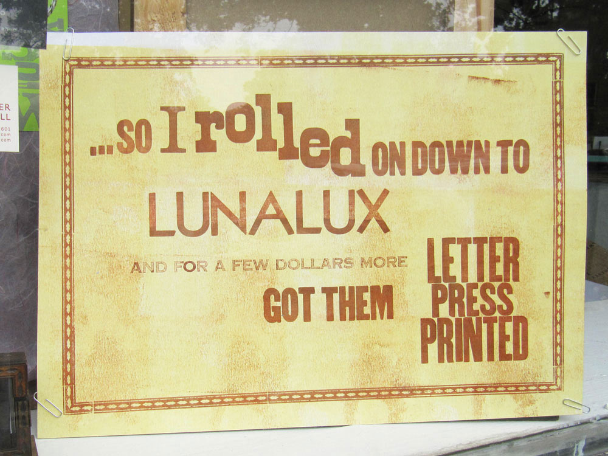
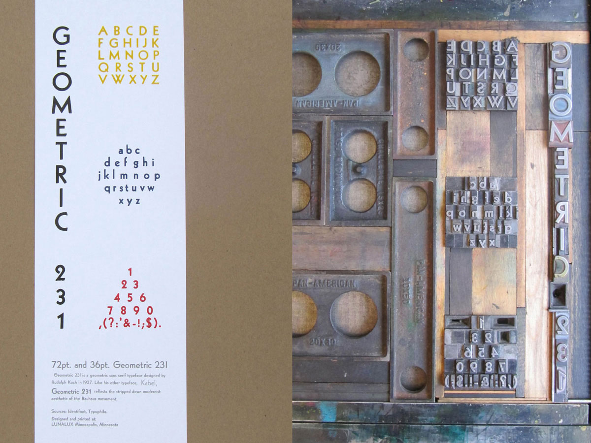
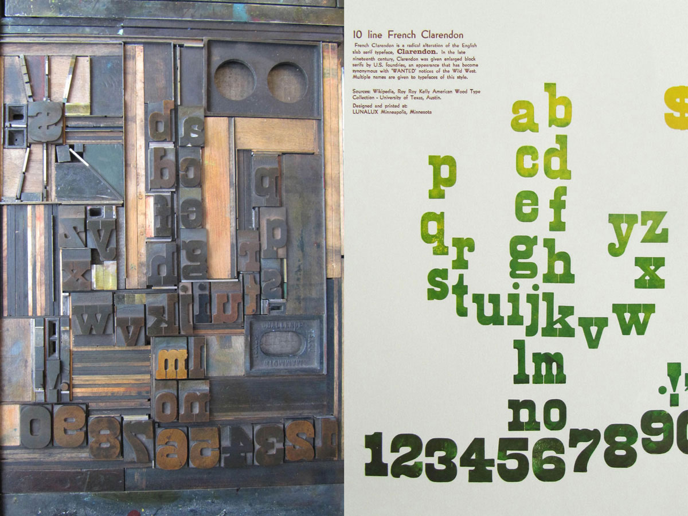
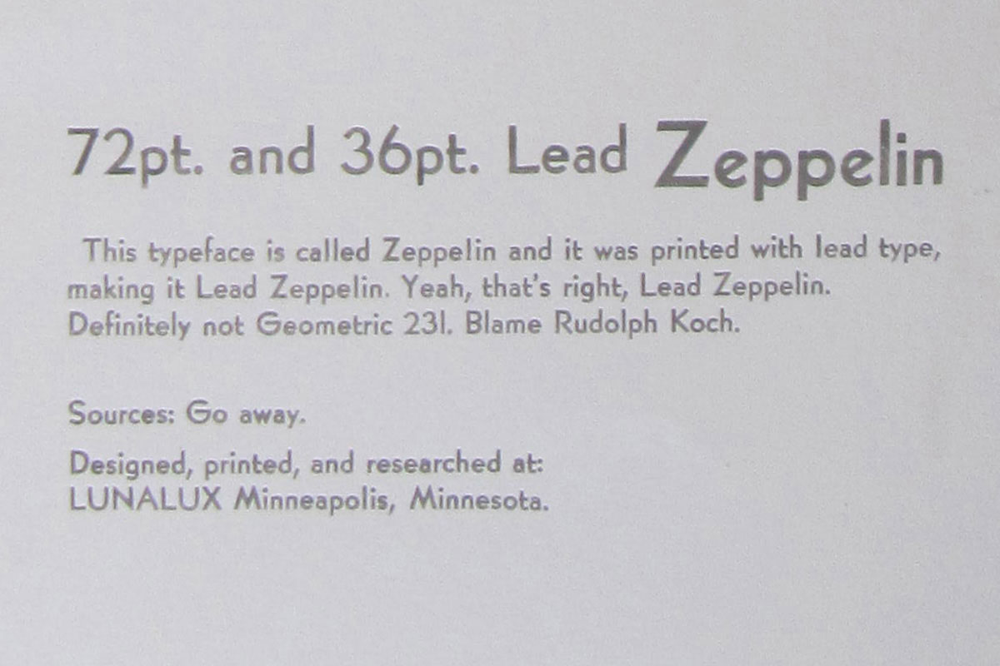
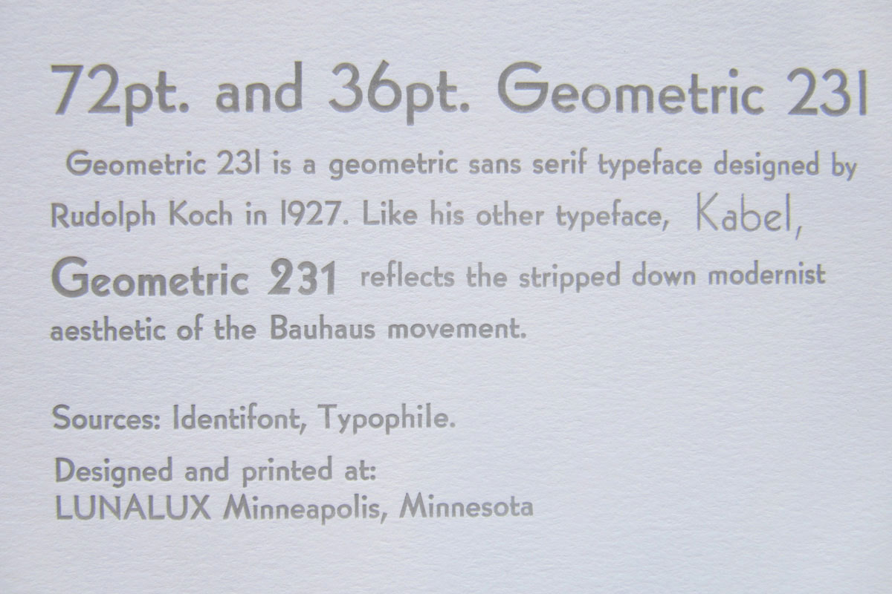
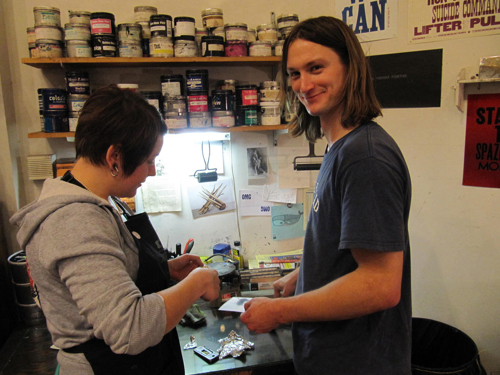

### Lunalux
Letterpress Print Design
Creative Projects from an internship at a Letterpress Print Studio

---

# Lunalux
Design and Promotion for Letterpress Print

---

For four months in 2012, I interned at a Letterpress Print Studio in Minneapolis, U.S.A., while living with relatives just west of the city.

Although Lunalux has sadly now closed, the company once offered design and print services from it's central Minneapolis location, also running printing workshops from time to time. One workshop I got to help out at was held at the world’s first ‘Internet Cat Video Festival,’ at the nearby Walker Art Centre. Only in Minnesota! Popular products included custom wedding invitations, stationery, and greetings cards, printed on manual printing presses, and a semi- automatic Heidelberg press.

Two notable projects I worked on here were to create a promotional display for the store window, and type specimen posters, which sample the characters and glyphs in a typeface. I added to the typical type specimen format with a short paragraph explaining the history, usage, and culture surrounding each typeface. As you can see from both projects, this formed the sole inspiration for the designs.

I really enjoyed the opportunity to work with more tactile media, and look back fondly at my time at Lunalux.

---

left column

---

right column

---

left column

---

right column

---

left column

_What initial research lead me to think/hope a certain typeface was called!_

---

right column

_...and what it actually turned out to be_

---

center column

_My final day in the studio, with Morgan_

---

other project
### To see more conventional information design, check out:
angela-jaleel
