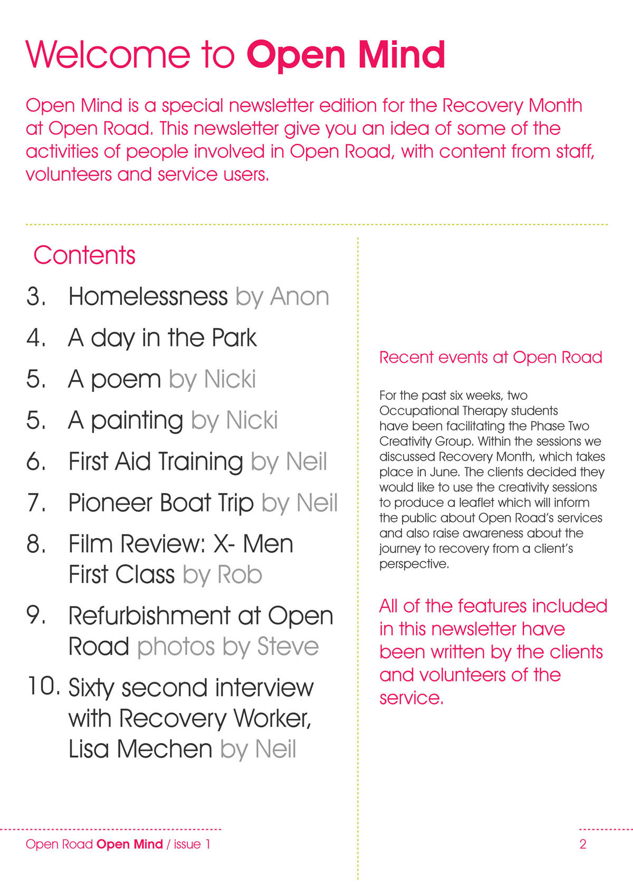

# Open Road
Charity Newsletter
Following the signature style in a one-off newsletter for the charity, Open Road

---

# Open Road
Open Mind - Digital Newsletter

---

I designed an issue of Open Mind newsletter for Open Road, a charity that provides support for individuals affected by drug and alcohol in Essex and Suffolk. This was a one-off newsletter that featured stories from service users and staff at the Chelmsford centre as part of the charity's annual ‘Recovery Month’. Held in June every year, ‘Recovery Month’ is a series of public events and activities that show how Open Road helps people to lead lives free from substance addiction.

I followed the Open Road brand guidelines, adding my own illustrations that align to their signature style of a continuous neon red line bleeding off the page.

[Download the Open Mind newsletter here.](open-road-open-mind.pdf)

---

left column

_Front Cover_

---

right column

_Contents_

---

left column

_Story of an anonymous service user_

---

right column

_Poem and painting contributed by a service user_

---

left column

_Staff account of a day out_

---

right column

_Redecorating at Open Road_

---

center column

_Interview with a member of staff_

---

other project
### A look and feel I helped to refresh, and more digital newsletters:
cmc