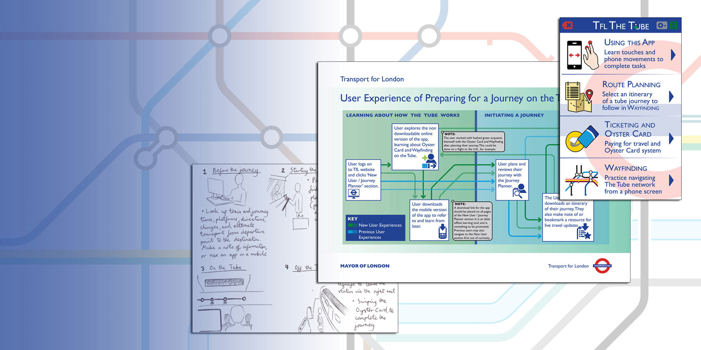
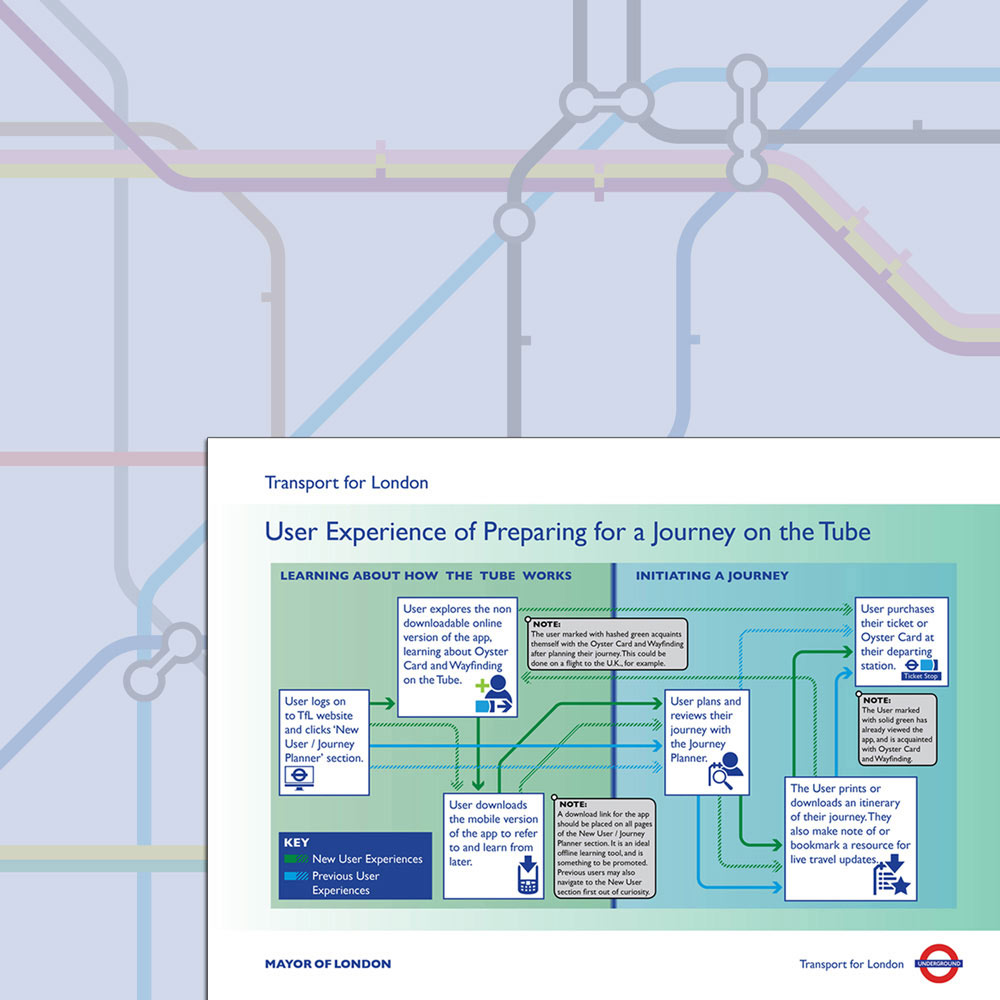
# TFL The Tube
UX Design
Visualising how the User Experience of the London Underground could run more smoothly

---

# TFL The Tube
An experiment in User Experience design

---

In application to a job at a service design company, I answered a User Experience (UX) design brief. The brief asked me to visualise in six steps how a journey on London Underground could run more smoothly for new users of the service.

Inspired by this brief, I went on to map out the user flow in a potential mobile app, also mocking up still screens shown as the user makes their way through the transport system. Facets covered include ticketing systems, wayfinding at different stages, and personal safety.

## 1: Visualising the user experience
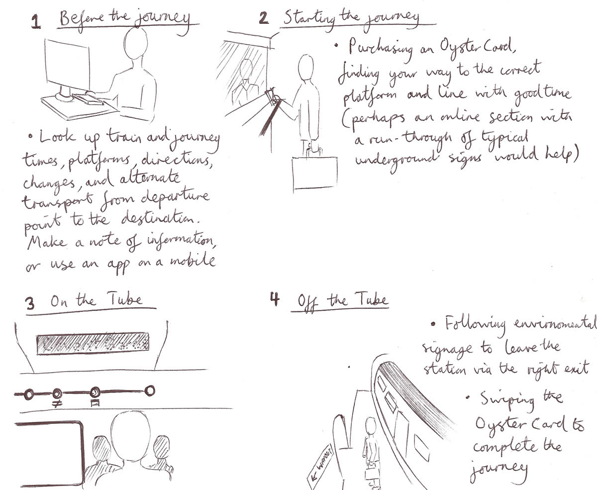
_Breakdown of processes in the user experience_

---

left column
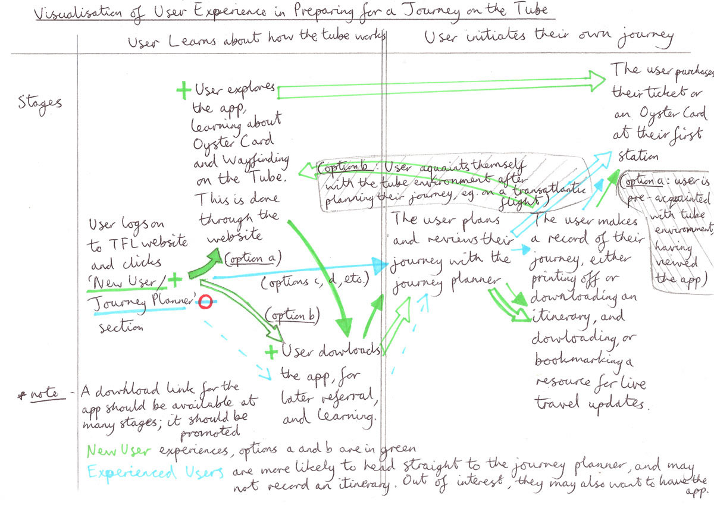
_User experience map takes new and recurring users into account_

---

right column
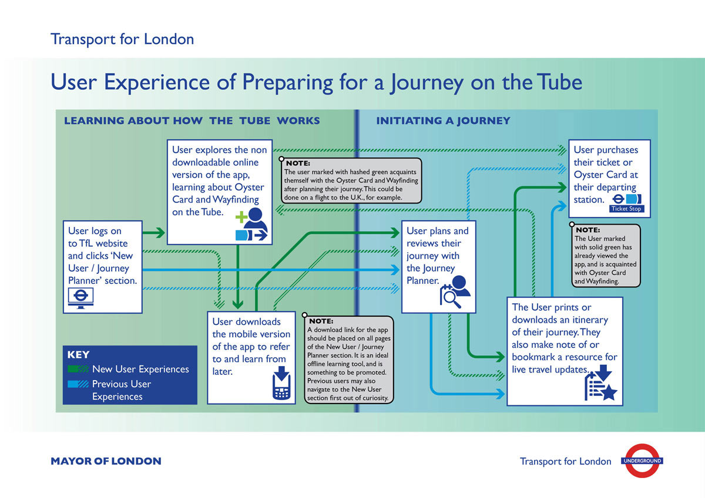
_Final version of the user experience map_

---

center column
## 2: Planning the app
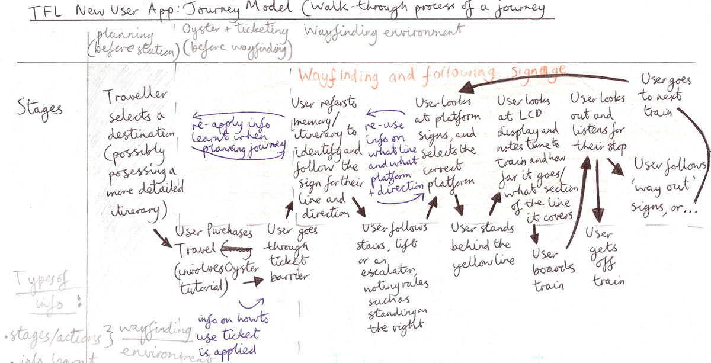
_Sequence of wayfinding stages_

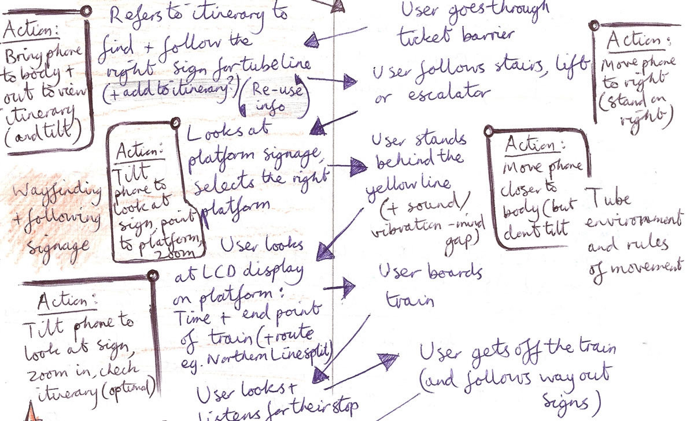
_Potential movement and touch gestures to contextualise stages_

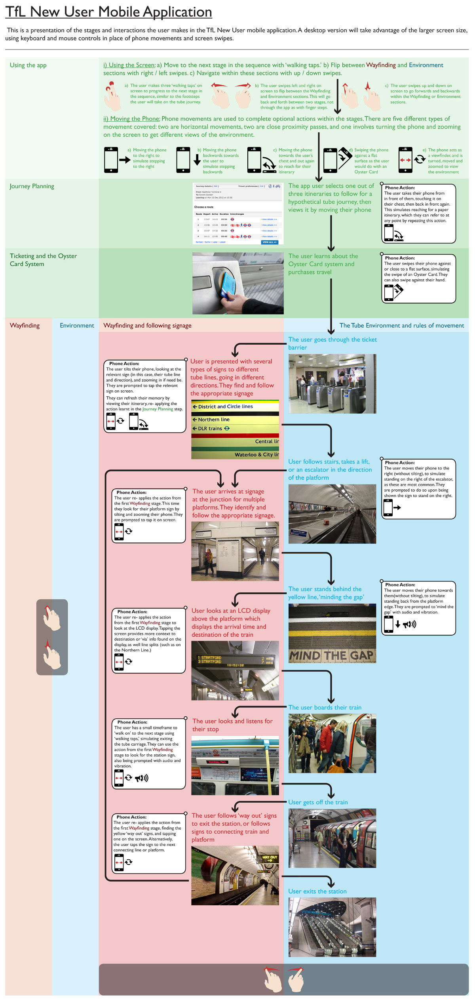
_Plan for the app distinguishes between wayfinding actions and movement_

## 3: Branding and screen mockups

---

left column
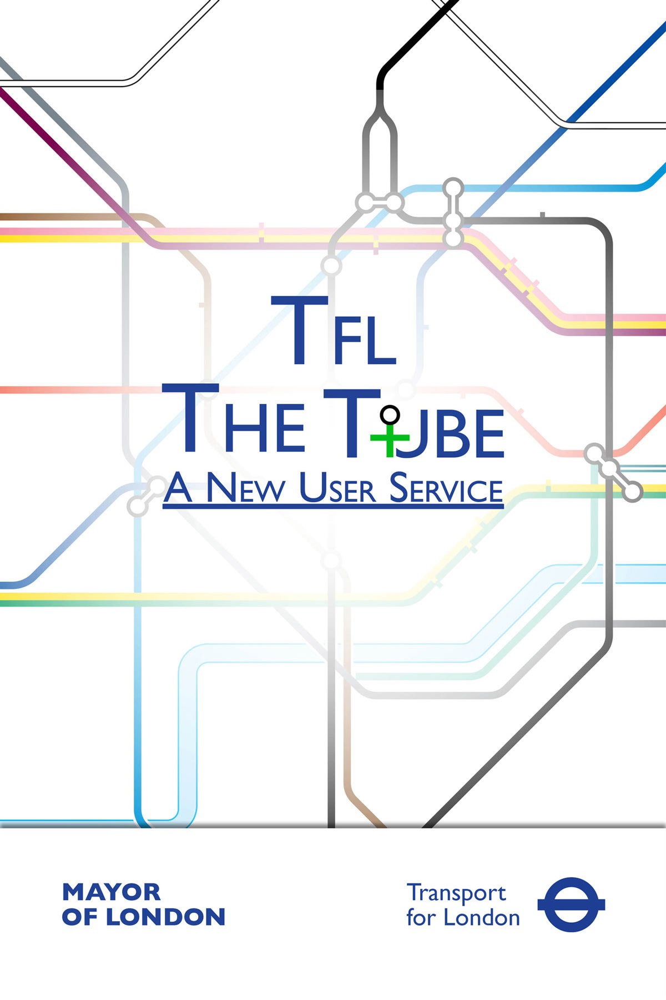
_App intro / loading screen_

---

right column
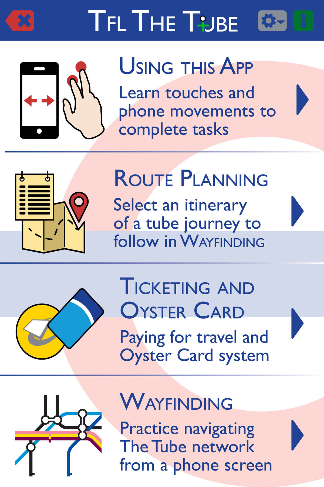
_App menu_

---

left column
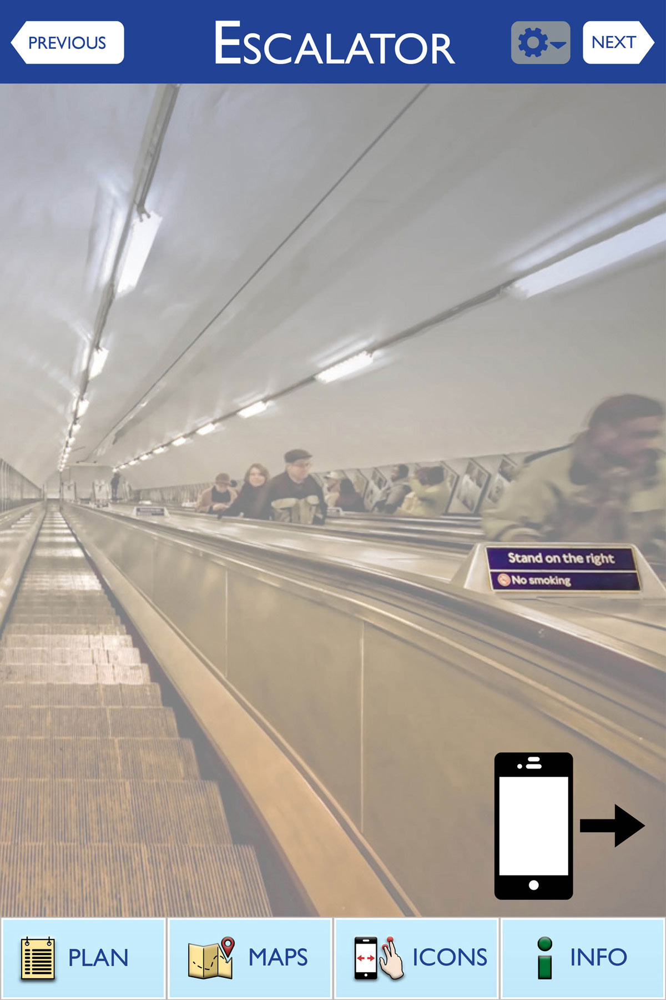
_App notifies the user of subtle rules such as standing on the right of escalators_

---

right column
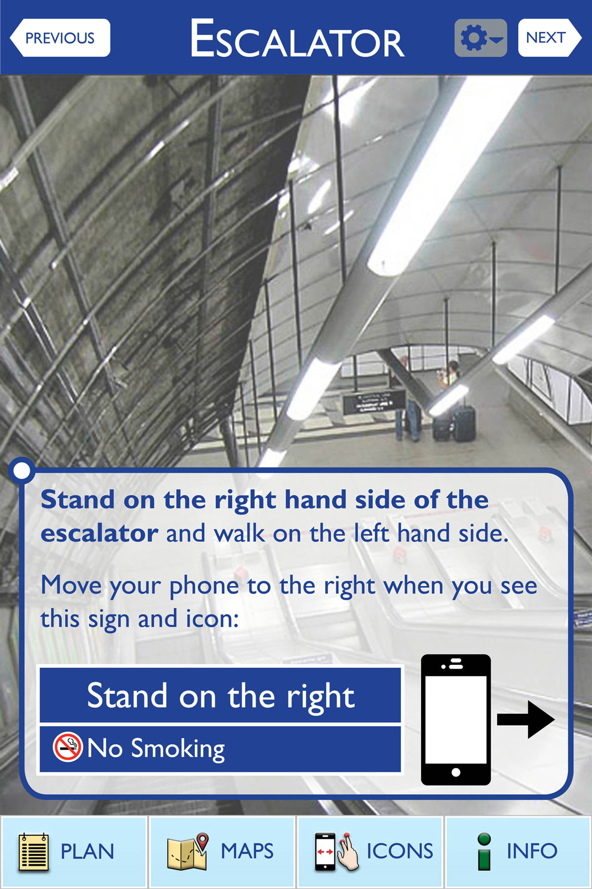
_Prompt to stand on the right side the the escalator_

---

other project
### Liked the branding but want to see a real-world branding application?
able-mediation