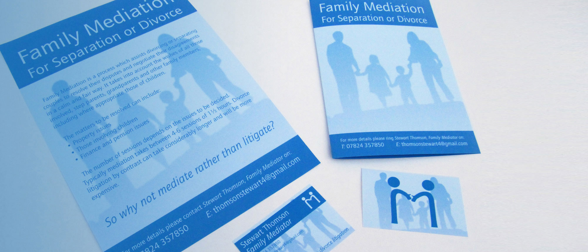
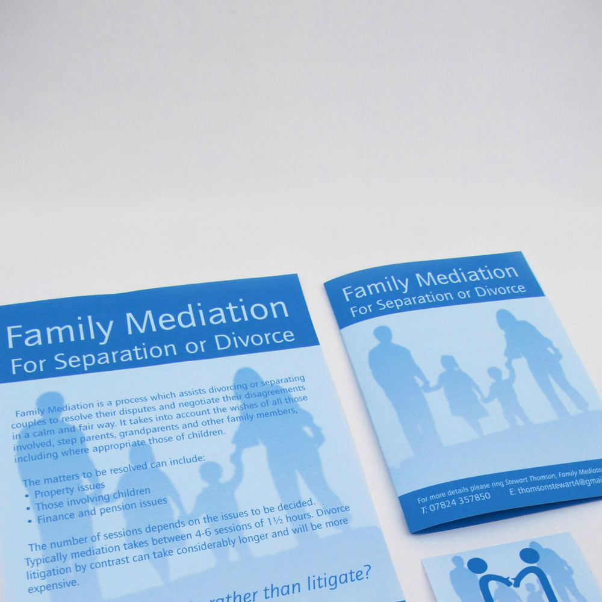
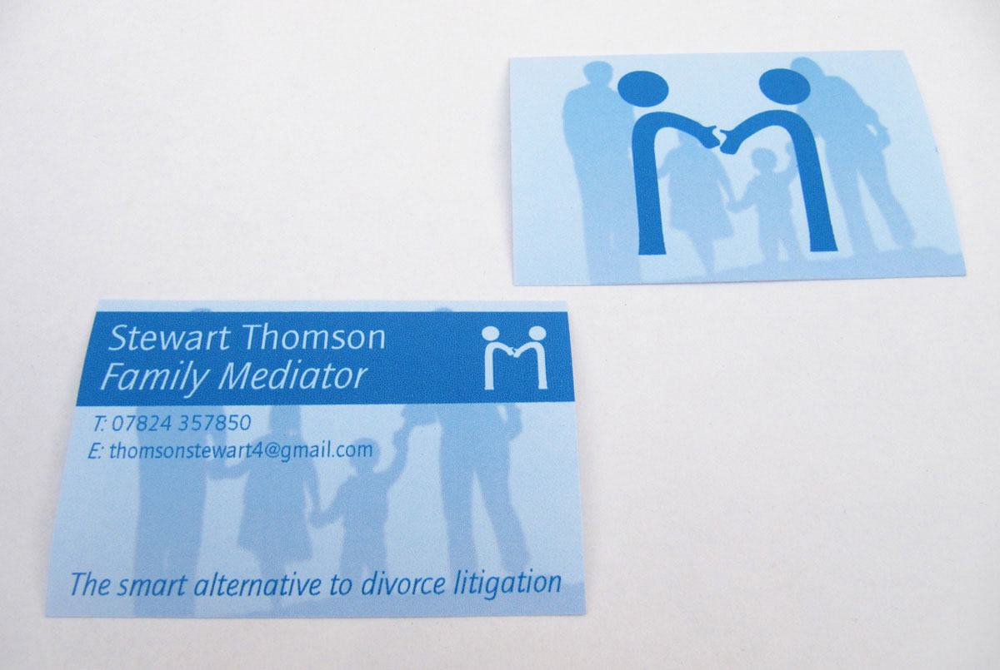
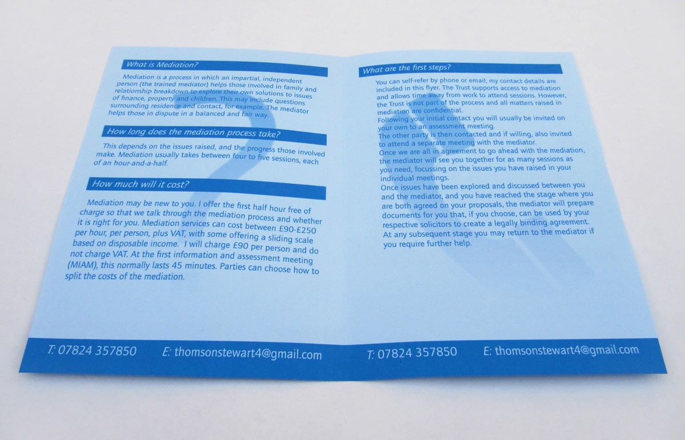
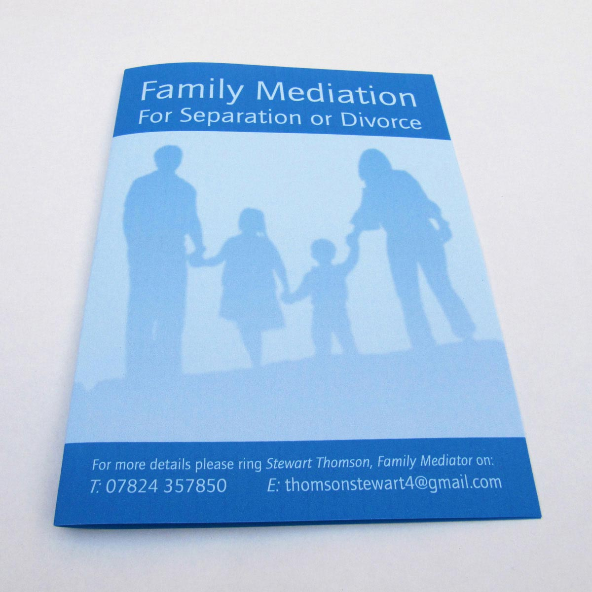
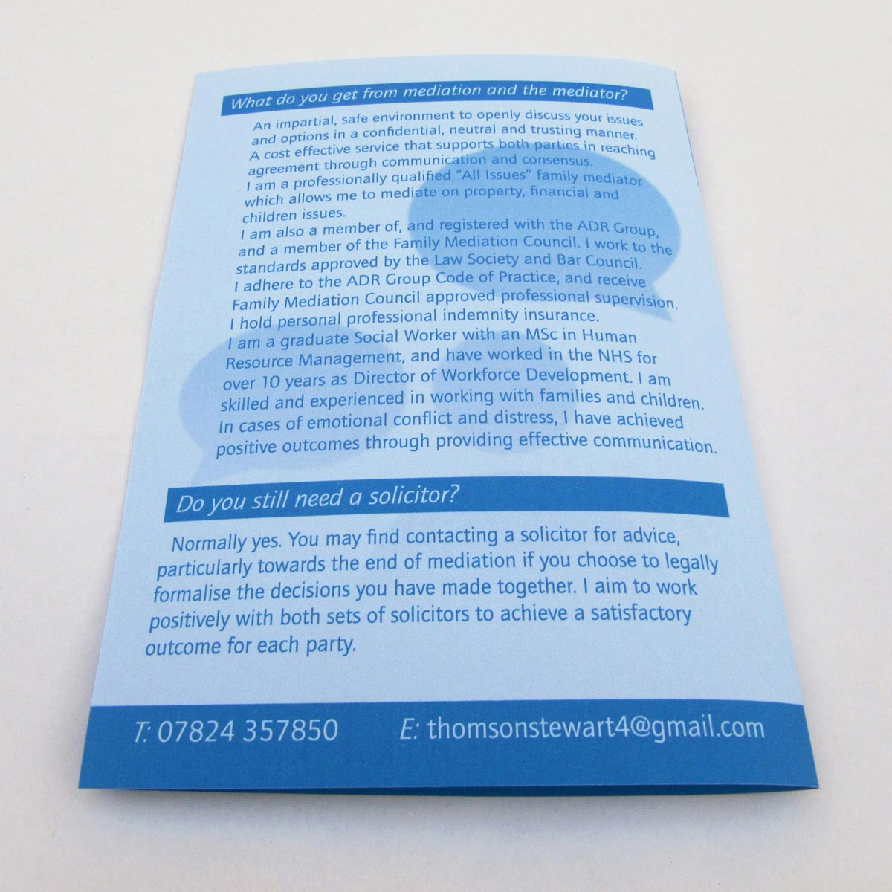
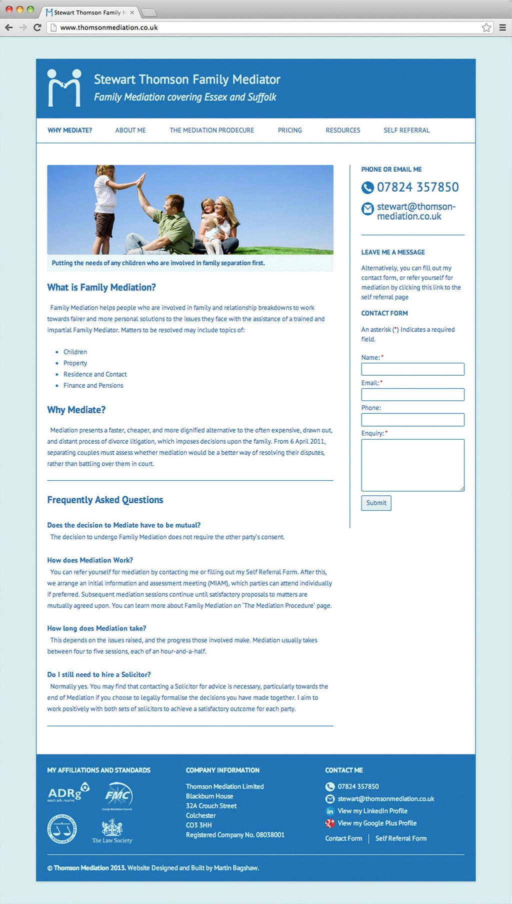
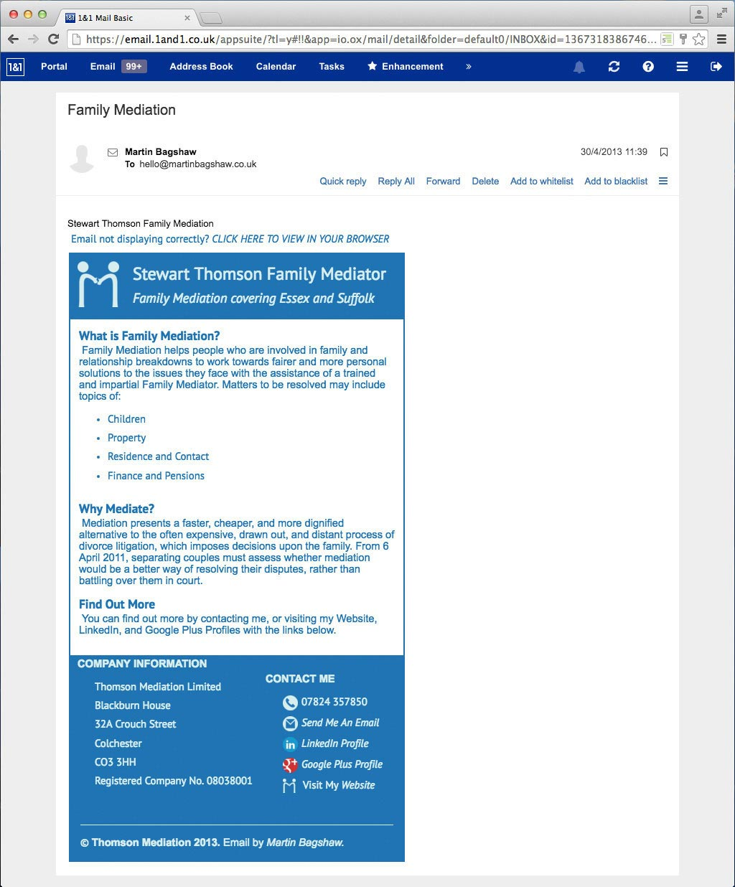

### Thomson Mediation
Identity Project
A positive and disarming identity for an independent Family Mediator

---

# Thomson Mediation
Identity for a Family Mediator

---

One of my early projects was to create the visual identity for a Family Mediator, Stewart Thomson.

Family Mediation is a more cooperative and less stressful alternative to divorce litigation. It involves separating couples negotiating their future arrangements face to face, in the presence of a neutral Mediator. Such is the success of Family Mediation that in April 2014, the U.K. Government made it a legal requirement for couples to go to attend an initial mediation information and assessment meeting before they can take their case to court, also providing Legal Aid to pay for this meeting for people who are on a low income.

For Thomson Mediation, I selected cool blue colours and Quay Sans typeface to create an approachable but professional look, reflecting the disarming and neutral role of the Family Mediator. I applied this identity to printed matter first, before producing a WordPress website and HTML marketing email.

_Business Cards_

_Brochure Design_

---

left column

---

right column

---

center column

_Website Home Page_

---

other project
### A project where I followed, rather than created brand guidelines:
open-road

_HTML Email_