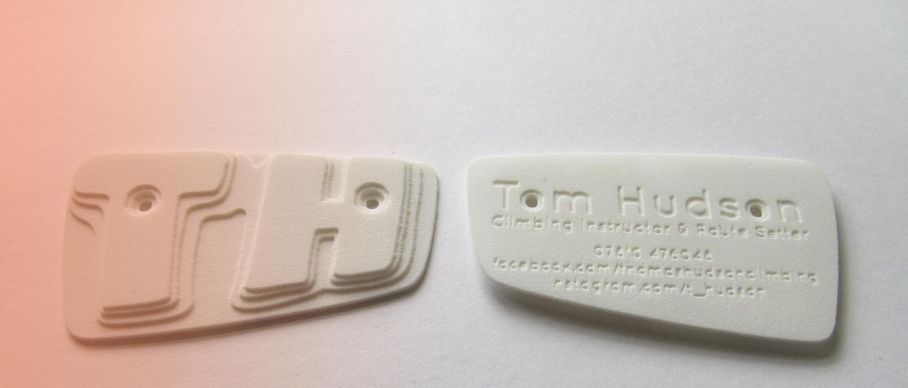
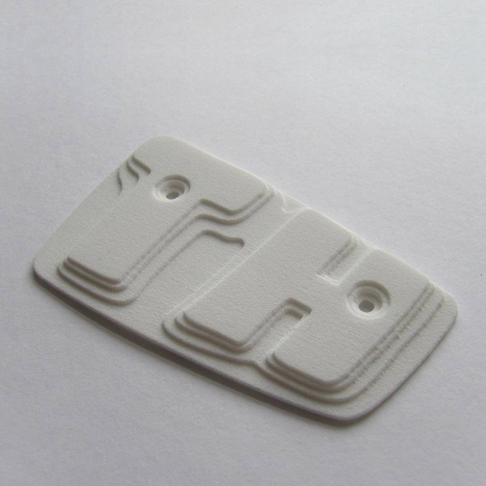
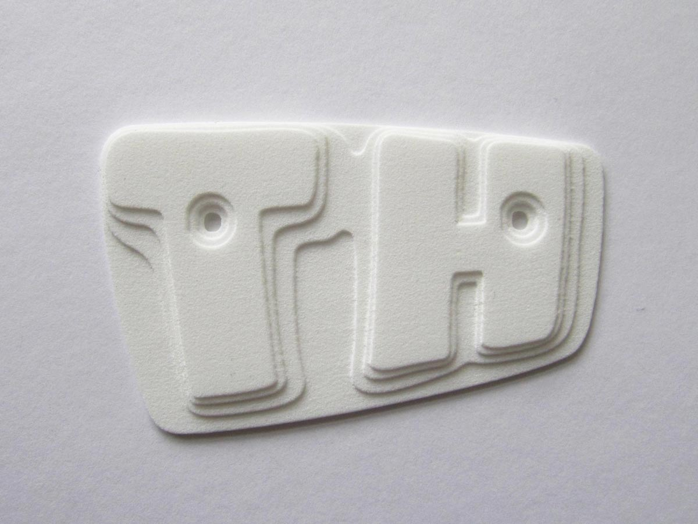
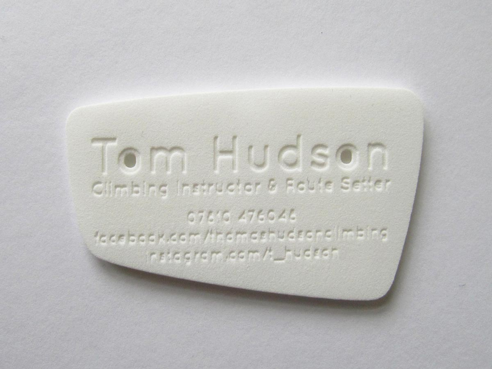

### # Tom Hudson
3D Business Card
3D Printed Business Card for a Climbing Instructor and Route Setter

---

# Tom Hudson
3D Printed Business Card

---

I had an idea one day to help a friend stand out from the crowd, one that just had to come to fruition. Moving away from my two-dimensional background, I got to grips with an open source 3D software program called Blender to create a three-dimensional business card reminiscent of an indoor climbing hold. With Tom happy with the design, I sent it off to 3DPRINT-UK to get the cards produced.

---

left column

---

right column

---

center column

While waiting for the cards to come back from the printer, I thought it would be interesting to try out WebGL (Web Graphics Library) to render my design in a web browser. To do this, I used three.js in combination with a Blender Addon to export the file as JSON code. Below is the result. [Click Here to view fullscreen](/work/tom-hudson/3d-card).

<iframe src="tom-hudson/3d-card"></iframe>

---

other project
### For a bigger dose of the digital, you might like:
james-torble
