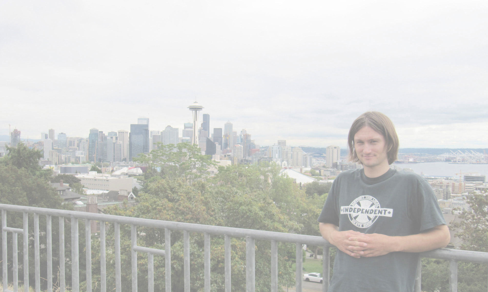

## About Me
More about me

---
# About Me
---

I like design that is widely understandable, elegant and memorable.

My preference is to work on projects that serve a good cause: to educate, help the disadvantaged, or work to solve complex problems.

I have been designing and developing on a freelance basis and in house at small companies for around five years. I enjoy projects most when they span a wide variety of different media, there is opportunity to learn new skills and techniques, and when I get to work with great people.

If you are interested in working on a project or discussing an idea, please do not hesitate to get in touch:

[07743 035217](tel:+447743035217)

[Email Me](mailto:hello@martinbagshaw.co.uk|safe_email)

_Seattle, September 2016_

---

other project
## View the Design Projects in my Portfolio:
work
